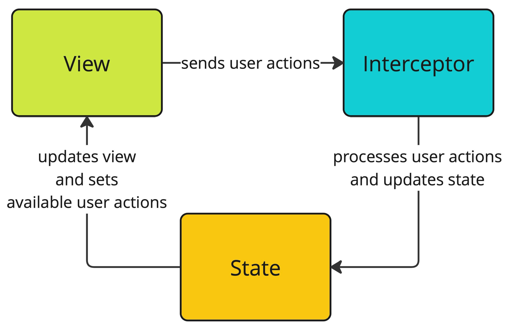

# StatefulArch

 This package contains a set of useful entities to develop scalable iOS applications using either SwiftUI or UIKit along with Combine.
 
## Installation

You can install this package using [Swift Package Manager](https://www.swift.org/package-manager/) by adding the following line to the `dependencies` in your `Package.swift` file:

```swift
dependencies: [
    .package(url: "https://github.com/purenative/StatefulArch.git", .upToNextMajor(from: "1.0.0"))
]
```

## Architecture Overview

StatetefulArch proposes to split screens into independent modules which of them consists of three main components - View, Interceptor and State.



### View

View is responsible for user interface and it doesn't contain any business logic or input data validations. Also it delegates user actions processing to Interceptor.

### Interceptor

Interceptor processes user actions received from View and updates State. Interceptor may contain input data validations but it's not responsible for business logic directly. 

> There is another entity in this architecture called Scenario which is responsible for business logic. Scenario isn't displayed on the diagram due to business logic optionality - some screens may not contain business logic such as screens which only contain static content.

### State

This entity stores screen's state and determines View's behavior.

## License

StatefulArch is released under the [MIT license](LICENSE).
